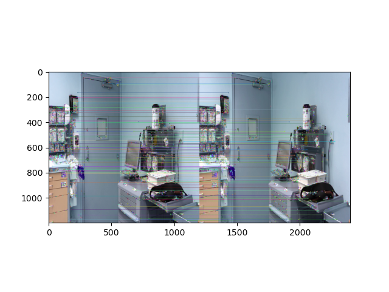

# OR-VSLAM

## Dependencies
The code was tested under the following dependencies
- python 3.8.5
- opencv-python 4.5.1.48
- matplotlib 3.3.2

## Execution
Before execution, put two images that will be tested in the `asset` folder.

In order to execute, please type in the following command:
```
python3 sift.py
```
After the execution, the result will be saved under `output` folder.

## Sample Output

